# KEY Runtime Blueprint

## Purpose

This document connects KEY's vision to the runtime that makes the player experience possible.

It is intentionally written in plain language. Each stage explains both what the system does and why the player should feel its effect.

> **KEY creates worlds where the story never stops being the game.**

## The Runtime at a Glance

```mermaid
flowchart TD
    P["PLAYER\nExpresses an intention in natural language or through an interface.\nPlayer effect: freedom to attempt meaningful action without memorizing rigid commands."]

    I["INTENT ENGINE\nDetermines what the player is trying to accomplish, independent of exact wording.\nPlayer effect: 'take the blade,' 'grab the sword,' and 'pick it up' can mean the same thing."]

    AP["ACTION PROPOSAL\nTurns understood intent into a structured request containing the actor, action, target, context, and relevant details.\nPlayer effect: the world responds to meaning rather than merely reacting to text."]

    RF["REALITY FIREWALL\nChecks whether the proposed action is possible, permitted, coherent, and consistent with current reality.\nPlayer effect: the world feels fair, grounded, and resistant to arbitrary contradictions."]

    CA["CANONICAL ACTION\nRepresents the validated action the world has accepted, including costs, timing, causes, and immediate consequences.\nPlayer effect: successful actions have a clear and dependable meaning."]

    CW["CANONICAL WORLD STATE\nStores what is objectively true about the world after the action is committed.\nPlayer effect: places, people, objects, relationships, injuries, promises, and political conditions remain consistent."]

    M["MEMORY AND KNOWLEDGE\nRecords what happened, who witnessed it, what each character learned, and how they interpreted it.\nPlayer effect: characters remember, misunderstand, forgive, resent, suspect, and change."]

    T["TIME AND WORLD PROGRESSION\nAdvances clocks, travel, deadlines, needs, factions, institutions, and unattended events.\nPlayer effect: the world continues beyond the current conversation and does not freeze when ignored."]

    SD["STORY DIRECTOR\nRecognizes pressure, possibility, unresolved consequences, and meaningful developments without selecting a predetermined ending.\nPlayer effect: events gather momentum while choices remain genuinely consequential."]

    N["NARRATOR AND EXPERIENCE LAYER\nPresents the results through prose, dialogue, interface, sound, visuals, or other forms appropriate to the experience.\nPlayer effect: the player understands what changed, why it matters, and what possibilities now exist."]

    P --> I --> AP --> RF --> CA --> CW
    CW --> M
    CW --> T
    M --> SD
    T --> SD
    SD --> N
    N --> P
```



The final arrow returns to the player because narration is not the end of the process. It creates the next situation in which the player chooses what to do.

## The Core Loop

```text
Situation
    ↓
Player intention
    ↓
Understood action
    ↓
Reality checks
    ↓
World change
    ↓
Memory, time, and consequence
    ↓
New situation
```

This is the practical meaning of:

> **The story never stops being the game.**

## What Each Stage Protects

### 1. Player

The player is a participant in history, not merely a consumer of prepared scenes.

KEY should allow the player to express meaningful intentions naturally. The player does not need to know the internal schema, action names, or implementation details.

**Protects:** agency, accessibility, experimentation, and ownership of the story.

### 2. Intent Engine

The Intent Engine asks:

> What is the player trying to do?

It separates meaning from phrasing. Different interpreters may eventually use deterministic parsing, language models, interface choices, voice input, or other methods. The runtime should not depend permanently on any one interpreter.

**Protects:** natural interaction and replaceable technology.

### 3. Action Proposal

The Action Proposal is the boundary between interpretation and reality.

It does not declare that something happened. It describes what the player or another actor is attempting to make happen.

A proposal may identify:

- the acting entity;
- the intended action;
- a target or destination;
- tools or resources involved;
- the player's stated manner or tone;
- assumptions or unresolved references;
- confidence and provenance from the interpreter.

**Protects:** auditability, modularity, and the rule that AI may propose but may not directly rewrite reality.

### 4. Reality Firewall

The Reality Firewall asks questions such as:

- Is the target present?
- Is the actor physically capable?
- Does the actor possess the necessary knowledge?
- Is the action allowed by the world's rules?
- Is distance, time, or access a barrier?
- Is another person resisting?
- What resources or costs are required?
- Would accepting the action contradict established truth?

The firewall may accept, reject, modify, defer, or require resolution of the proposal.

A failed attempt can still produce consequences. Trying to open a locked door may make noise. Attempting to deceive someone may create suspicion. Being unable to save a person may transform the story.

**Protects:** fairness, causality, continuity, and meaningful failure.

### 5. Canonical Action

A Canonical Action is an accepted and resolved occurrence.

It identifies what actually happened rather than what was merely requested. It should include enough information to explain its causes, participants, timing, costs, affected entities, and immediate consequences.

**Protects:** precision and reliable state transition.

### 6. Canonical World State

Canonical World State is the authoritative reality of the world.

Generated prose is not the source of truth. A narrator may describe rain poetically, but whether it is raining must come from structured reality. A character may falsely claim the king is dead, while canonical state records that the king is alive.

**Protects:** objective truth, consistency, persistence, and replayable history.

### 7. Memory and Knowledge

World truth and personal understanding are not the same thing.

This stage records:

- objective event history;
- who perceived an event;
- what each character knows;
- what each character believes;
- emotional and relationship consequences;
- uncertainty, deception, and false belief;
- the source and confidence of knowledge.

Two people can experience the same event and remember it differently without changing what objectively occurred.

**Protects:** character depth, situated knowledge, mystery, relationships, and consequence memory.

### 8. Time and World Progression

The world continues whether or not the player is watching.

This stage advances:

- clocks and calendars;
- travel and distance;
- deadlines;
- wounds, hunger, exhaustion, and recovery;
- faction plans;
- institutional processes;
- environmental changes;
- unattended conflicts and opportunities.

Progression must remain causal and bounded. The world should live beyond the player, but it should not become random noise.

**Protects:** urgency, independent world life, strategic consequence, and historical continuity.

### 9. Story Director

The Story Director does not secretly choose the ending.

It interprets the evolving state to identify:

- active pressure;
- unresolved promises and threats;
- possible revelations;
- relationship turning points;
- consequences ready to return;
- meaningful choices;
- emerging arcs;
- situations that deserve focus or compression.

It may shape attention and presentation, but it may not violate canonical truth, character agency, or earned consequence.

**Protects:** momentum, coherence, dramatic meaning, and open futures.

### 10. Narrator and Experience Layer

The Narrator and Experience Layer turns validated reality into something the player can perceive.

Depending on the product, this may include:

- written narration;
- dialogue;
- menus and controls;
- visual scenes;
- maps;
- animation;
- sound and music;
- summaries, journals, or chronicles.

Presentation may vary dramatically while the underlying runtime remains stable.

**Protects:** clarity, immersion, emotional impact, and interface independence.

## Stable Core and Replaceable Edges

The blueprint separates what KEY must protect from what technology may replace.

### Stable Core

- Action Proposal contract
- Reality validation
- Canonical actions
- Canonical world state
- Memory and knowledge boundaries
- Time progression
- Causal and auditable state transitions

### Replaceable Edges

- Natural-language interpreter
- Model provider
- Narration model
- User interface
- Visual presentation
- Voice system
- World-specific content modules

This separation allows KEY to improve its intelligence and presentation without sacrificing the integrity of its worlds.

## The North Star Tests

Every runtime feature should pass four questions.

### Player Test

Does this give the player more meaningful freedom or help them understand the consequences of their choices?

### World Test

Does this make the world more coherent, persistent, independent, and capable of remembering?

### Story Test

Does this create stronger situations, choices, consequences, relationships, or transformations?

### Architecture Test

Does this preserve a stable core and replaceable edges, or does it create unnecessary coupling and technical debt?

A feature that fails these tests should be revised, reduced, or removed.

## Current Implementation Focus

Winter Medicine is the laboratory for proving this loop at small scale.

The immediate architectural milestone is to stabilize the path from:

```text
Player input
    ↓
Intent
    ↓
Action Proposal
    ↓
Validation
    ↓
Canonical Action
    ↓
State Commit
    ↓
Narration
```

The goal is not to make one prototype appear large. The goal is to prove that one small world can understand, decide, remember, change, and continue.